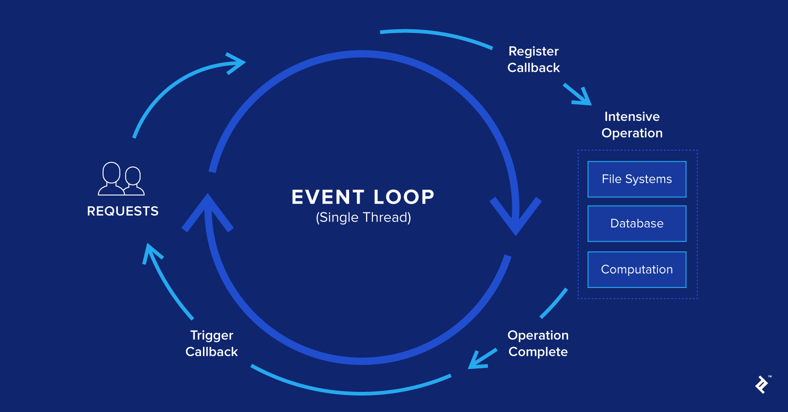

# A self guide to help one understand how design patterns are in Javascript

Before one dives into design patterns, one has to understand what Javascript offers and what sets it apart.

## _Javascript First class functions_

Javascript treats functions as first class citizens, meaning you can pass functions as parameters to other functions.

```Javascript
function performOperation (a,b,cb) {
    var c = a + b;
    cb(c);
}

performOperation(2, 3, function(result) {
    // prints out 5
    console.log("The result of the operation is " + result);
})
```

## _Javascript is prototype based_

Javascript supports objects, and one of the first terms that pop in mind for anyone when talking about objects is classes and inheritance.
The langugage doesn't support classes, but in _ES6_ the formal term 'Class' is introduced, but still it uses prorotype based inheritance under the hood.

Prototype-based programming is a style of object oriented programming in which behavior reuse is
performed via a process of reusing existing objects via delegations that server as prototypes.

## Javascript Event Loops

Javascript is single threaded. Each time an event, which has a listener attached to it, fires, a message
is being sent to a queue of messages which are being processed synchronously.
This is called event loop.

Each of the messages on the queue has a function associated with it.



---

title: Event Loop
featuredImage: event-loop.png

---

Once a message is dequeued, the runtime executes the function completely before processing any other message.
This is to say, if a function contains other function calls, they are all performed prior to processing a new message from the queue. This is called run-to-completion.

```js
while (queue.waitForMessage()) {
  queue.processNextMessage();
}
```

## Design patterns Categorization

- Creational
- Structural
- Behavioral
- Concurrency
- Architectural

### Creational Design Pattterns

These deal with object creation mechanisms which optimize object creation
compared to a basic approach.

These patterns basically control the object creation.

- Factory method
- Abstract factory
- Builder
- Prototype
- Singleton
